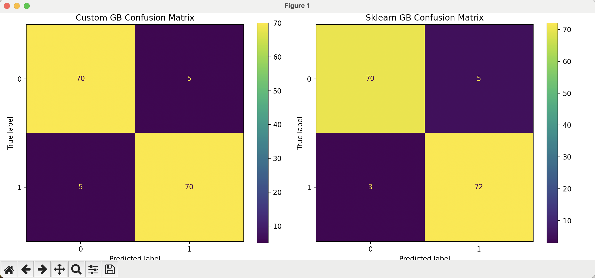
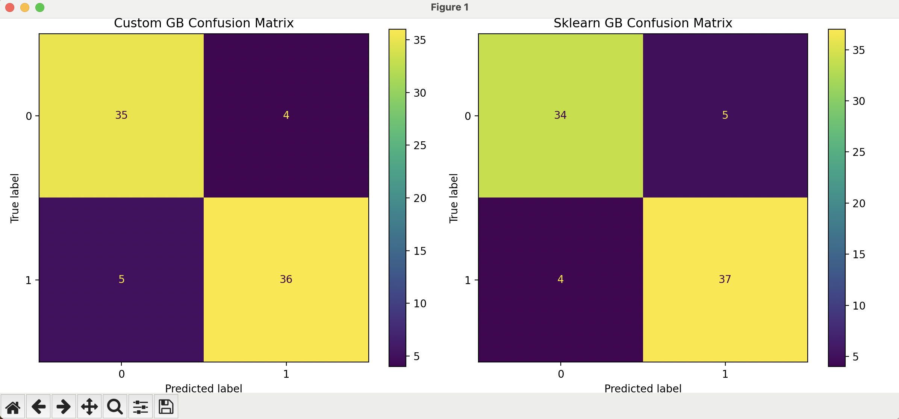
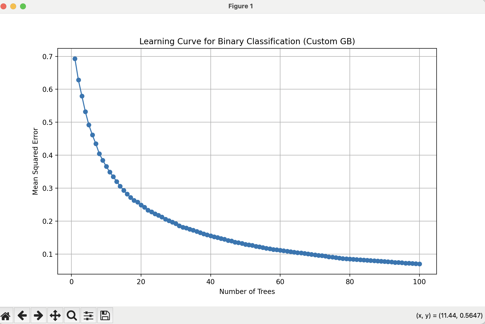
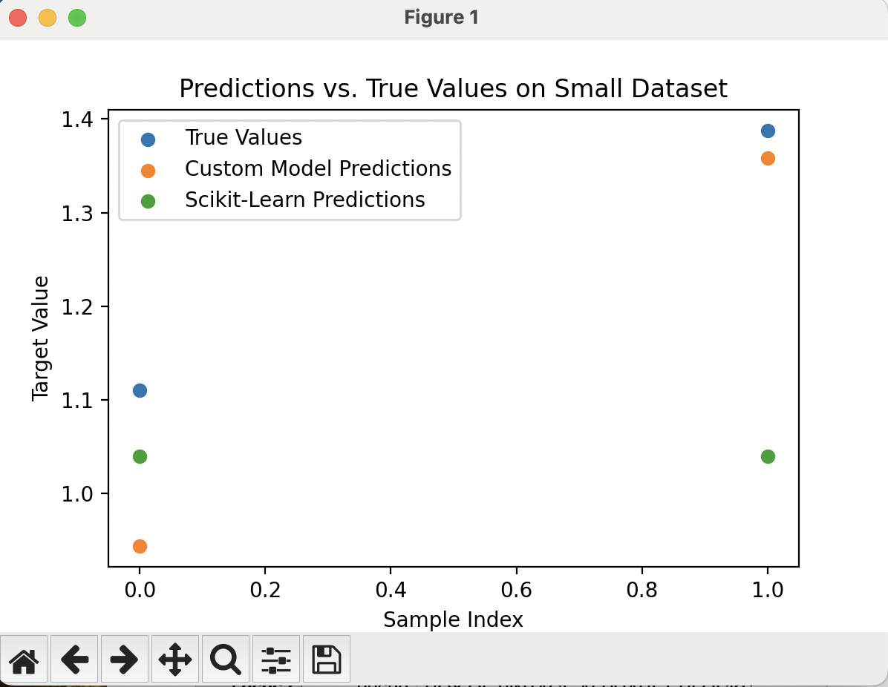
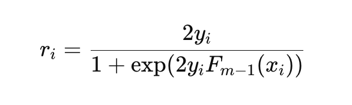

# Gradient Boosting Algorithm


## Group Members (ML-Geeks)

| Name               | A-Number     | Name                      |
|--------------------|--------------|---------------------------|
| Tarun Sai Tirumala | A20544933    | ttirumala@hawk.iit.edu    |
| Lokesh manchikanti | A20544931    | Lmanchikanti@hawk.iit.edu |
| Jaswanth Reddy Sure| A20552169    | jsure@hawk.iit.edu        |
| Vinay kumar moka   | A20552044    | Vmoka@hawk.iit.edu        |


### Installation

No external installation is required beyond the standard Python libraries. Ensure you have the following packages installed:

- Python 3.11
- NumPy
- Matplotlib (to plot the graphs)
- scikit-learn (only for testing and comparison purposes)


1. First setup virtualenv make sure you have virtualenv package (Inside root project directory)
```bash
virtualenv venv  
```
2. Activate it (In the same folder where venv has been created)
```bash
source venv/bin/activate 
```

2. You can install the required packages using pip:

```bash
pip install -r requirements.txt
```

### Data Preparation

Prepare your dataset in the form of NumPy arrays:

- `X`: A 2D NumPy array of shape `(n_samples, n_features)` containing the input features.
- `y`: A 1D NumPy array of shape `(n_samples,)` containing the target values (continuous for regression, class labels for classification).

Ensure that your data does not contain any NaN or infinite values unless you intend to handle missing values within the model.

### Examples


#### Classification Example

Here's an example of how to use the custom `GradientBoosting` for binary classification:

```python
import numpy as np
from model.gradient_boosting import GradientBoosting

# Generate sample data for classification
np.random.seed(42)
X = np.random.rand(100, 2) * 10  # Features
y = (np.sin(X[:, 0]) + np.cos(X[:, 1]) > 1).astype(int)  # Binary target

# Introduce missing values
mask = np.random.rand(*X.shape) < 0.1  # 10% missing values
X[mask] = np.nan

# Split the data into training and testing sets
from sklearn.model_selection import train_test_split

X_train, X_test, y_train, y_test = train_test_split(X, y, test_size=0.2)

# Initialize and fit the model for classification
gb_clf = GradientBoosting(
    loss='logistic',
    n_estimators=100,
    learning_rate=0.1,
    max_depth=3,
    handle_missing='mean'  # Options: 'none', 'mean', 'median'
)
gb_clf.fit(X_train, y_train)
# plot graph 
gb_clf.plot_learning_curve("Graph name")
# Make predictions
y_pred = gb_clf.predict(X_test)
y_proba = gb_clf.predict_proba(X_test)[:, 1]

# Evaluate the model
from sklearn.metrics import accuracy_score

accuracy = accuracy_score(y_test, y_pred)
print('Classification Accuracy:', accuracy)
```

#### Regression Example

Here's a simple example of how to use the custom `GradientBoosting` for regression:

```python
import numpy as np
from model.gradient_boosting import GradientBoosting

# Generate sample data
np.random.seed(42)
X = np.random.rand(100, 1) * 10  # Features
y = np.sin(X).ravel() + np.random.randn(100) * 0.1  # Target with noise

# Introduce missing values
mask = np.random.rand(*X.shape) < 0.1  # 10% missing values
X[mask] = np.nan

# Split the data into training and testing sets
from sklearn.model_selection import train_test_split

X_train, X_test, y_train, y_test = train_test_split(X, y, test_size=0.2)

# Initialize and fit the model for regression
gb_reg = GradientBoosting(
    loss='squared_error',
    n_estimators=100,
    learning_rate=0.1,
    max_depth=3,
    handle_missing='mean'  # Options: 'none', 'mean', 'median'
)
gb_reg.fit(X_train, y_train)

# Make predictions
y_pred = gb_reg.predict(X_test)
gb_reg.plot_learning_curve("Professor given data")
# Evaluate the model
from sklearn.metrics import mean_squared_error

mse = mean_squared_error(y_test, y_pred)
print('Regression MSE:', mse)
```

### Running the Tests

We have provided separate test case scripts to evaluate the model under different conditions:

- `test_small_dataset.py`
- `test_multicollinearity_dataset.py`
- `test_large_dataset.py`
- `test_missing_values_dataset.py`
- `test_classification_check.py` 
- `test_professor_data.py`

#### Test Cases Description

1. **Small Dataset**: Tests the model on a small synthetic dataset to verify performance with minimal data.

2. **Dataset with Multicollinearity**: Evaluates how the model handles features that are highly correlated.

3. **Large Dataset with More Features**: Assesses scalability and efficiency on large, high-dimensional datasets.

4. **Missing Values**: Tests the model's capability to handle datasets containing missing values.

5. **Classification Check**: Tests the model's performance on a binary classification task, including handling of missing values.

6. **Professor dataset**: It's dataset provided by professor for project-1

#### Running the Test Cases

To run a specific test case, execute the corresponding script: Go inside **tests** folder.

```bash
python test_small_dataset.py
```

Replace `test_small_dataset.py` with the desired test case file.

#### NOTE -
- Running test for larger datasets could take some time. Please wait till it finished.
- You will see multiple graphs as output while running testcases. Just close the graph to see next graph.
- I am using Macbook Pro - M1. If you still face any issue then try with Mac system or run inside docker.
---


## **Test Cases, Results, and Screenshots**

### **Test 1: test_classification_check Test**

```
Custom GB Accuracy: 0.9333333333333333
Sklearn GB Accuracy: 0.9466666666666667

```
 **Classification Matrix:** `gradient-boosting/result_images/class.png`

---

### **Test 2: test_large_data Test**

```
Results for Binary Classification Task:
Custom Gradient Boosting Classifier:
  Accuracy: 0.8875
  Training Time: 5.46 seconds
  Classification Report:
               precision    recall  f1-score   support

           0       0.88      0.90      0.89        39
           1       0.90      0.88      0.89        41

    accuracy                           0.89        80
   macro avg       0.89      0.89      0.89        80
weighted avg       0.89      0.89      0.89        80


Scikit-Learn Gradient Boosting Classifier:
  Accuracy: 0.8875
  Training Time: 0.06 seconds
  Classification Report:
               precision    recall  f1-score   support

           0       0.89      0.87      0.88        39
           1       0.88      0.90      0.89        41

    accuracy                           0.89        80
   macro avg       0.89      0.89      0.89        80
weighted avg       0.89      0.89      0.89        80


```
 **Classification Matrix:** `gradient-boosting/result_images/large.png`


 **Learning Curve:** `tests/screenshots/large_curve.png`

---

### **Test 1: test_small_dataset(Regressor) Test**

```
Results for Small Dataset:
Custom Gradient Boosting Regressor Metrics:
  MSE: 0.0143
  MAE: 0.0980
  R^2 Score: 0.2531
Scikit-Learn Gradient Boosting Regressor Metrics:
  MSE: 0.0631
  MAE: 0.2096
  R^2 Score: -2.2896

```
 **Regressor:** `gradient-boosting/result_images/small_reg.png`

---


## Code Implementation Explanation

This project implements a **Gradient Boosting Tree Classifier** from first principles, inspired by Sections 10.9–10.10 of *The Elements of Statistical Learning (2nd Edition)*. It follows a modular design using custom-built decision trees and gradient boosting logic for binary classification using logistic loss.

### Core Components

#### `DecisionTreeRegressor`
- Custom decision tree regressor designed to work as a weak learner.
- Supports:
  - Recursive tree building based on mean squared error (MSE).
  - Node splitting based on feature thresholds with optional subsampling of features.
  - Explicit handling of missing values during both training and inference.
  - Parameters such as `max_depth`, `min_samples_split`, `min_samples_leaf`, and `max_features`.

#### `GradientBoosting`
- Implements the main gradient boosting loop for **binary classification** and **regression**.
- Supports two loss functions:
  - `logistic` (for classification, based on exponential/logistic loss)
  - `squared_error` (for regression tasks)
- Key operations:
  - **Initial prediction**: For classification, uses log-odds of the positive class.
  - **Pseudo-residuals**: For logistic loss, calculated as:

    

  - **Tree fitting**: Each regression tree is trained on the pseudo-residuals.
  - **Model update**: Predictions from each tree are scaled by the learning rate and added to the model.
  - **Training loss tracking**: Stored after every boosting round for analysis.

#### Additional Features
- **Subsampling**: Enables stochastic gradient boosting via `subsample` parameter.
- **Missing value handling**:
  - `'none'`: Pass NaNs to trees (handled at split level).
  - `'mean'` / `'median'`: Impute missing values before training and prediction.
- **Classification Output**:
  - `predict()`: Returns final binary labels based on sigmoid-transformed logit scores.
  - `predict_proba()`: Returns class probabilities for binary classification.
- **Utilities**:
  - `plot_learning_curve(name)`: Plot training loss per iteration.
  - `plot_predictions_vs_actual(preds, y)`: Scatter plot for regression diagnostics.
  - `feature_importances_()`: Calculates basic feature importances using variance reduction at splits.

---


## Answers to the Questions

### 1. What does the model you have implemented do and when should it be used?

The implemented model is a **Gradient Boosting** algorithm that can perform both **regression** and **binary classification** tasks. It builds an ensemble of decision trees sequentially, where each new tree tries to correct the errors made by the previous ones by fitting to the negative gradients of the loss function.

**When to Use It**:

- **Regression Tasks**: Suitable for predicting continuous target variables.
- **Classification Tasks**: Suitable for binary classification problems.
- **Complex Relationships**: Effective when the relationship between features and the target is nonlinear and complex.
- **Medium to Large-sized Datasets**: Works well with datasets where the number of samples and features is moderate to large.
- **Datasets with Missing Values**: Capable of handling missing data when configured appropriately.
- **High-Dimensional Data**: With the `max_features` parameter, it can efficiently handle datasets with a large number of features.

### 2. How did you test your model to determine if it is working reasonably correctly?

We conducted comprehensive testing across multiple datasets and scenarios:

- **Synthetic Datasets**: Tested on synthetic datasets for both regression and classification to evaluate performance on known patterns.

- **Real-world Datasets**: Applied the model to real-world datasets to assess its effectiveness.

- **Datasets with Specific Challenges**:

  - **Small Dataset**: Verified model performance on minimal data to ensure it doesn't overfit or underfit.

  - **Dataset with Multicollinearity**: Evaluated how the model handles highly correlated features.

  - **Large Dataset with More Features**: Assessed scalability and performance on high-dimensional data.

  - **Missing Values**: Tested the model's ability to handle datasets with missing values using built-in mechanisms.

- **Classification Testing**: Created `test_classification_check.py` to specifically test the classification capabilities of the model, comparing performance with scikit-learn's `GradientBoostingClassifier`.

- **Comparison with Scikit-Learn**: Compared the custom implementation's performance with scikit-learn's `GradientBoostingRegressor` and `GradientBoostingClassifier` using appropriate metrics.

- **Visualization**: Plotted learning curves and feature importances to understand the model's training process and feature utilization.

- **Evaluation Metrics**: Calculated multiple metrics such as MSE, MAE, R² score, Accuracy, and Log Loss to get a comprehensive view of the model's performance.

The tests showed that the custom model's performance is comparable to scikit-learn's implementations, indicating that it is working correctly.

### 3. What parameters have you exposed to users of your implementation in order to tune performance?

The following hyperparameters are exposed:

- **loss**: Specifies the loss function to be optimized. Options are `'squared_error'` for regression and `'logistic'` for classification.

- **n_estimators**: Number of trees to be built in the ensemble.

- **learning_rate**: The contribution of each tree to the final model.

- **max_depth**: Maximum depth of each decision tree.

- **min_samples_split**: Minimum number of samples required to split an internal node.

- **min_samples_leaf**: Minimum number of samples required to be at a leaf node.

- **subsample**: Fraction of samples to be used for fitting each base learner.

- **max_features**: Number of features to consider when looking for the best split.

  - **Options**: An integer, a float (fraction of features), `'sqrt'`, `'log2'`, or `None`.

- **handle_missing**: Strategy for handling missing values.

  - **Options**: `'none'` (no handling), `'mean'` (mean imputation), `'median'` (median imputation).

**Usage Examples**:

- **Choosing the Loss Function**:

  - Regression:

    ```python
    gb = GradientBoosting(loss='squared_error', n_estimators=100)
    ```

  - Classification:

    ```python
    gb = GradientBoosting(loss='logistic', n_estimators=100)
    ```

- **Adjusting Learning Rate and Number of Estimators**:

  ```python
  gb = GradientBoosting(n_estimators=200, learning_rate=0.05)
  ```

- **Controlling Tree Complexity**:

  ```python
  gb = GradientBoosting(max_depth=5, min_samples_leaf=2)
  ```

- **Implementing Subsampling for Stochastic Gradient Boosting**:

  ```python
  gb = GradientBoosting(subsample=0.8)
  ```

- **Handling High Dimensionality**:

  ```python
  gb = GradientBoosting(max_features='sqrt')
  ```

- **Handling Missing Values**:

  ```python
  gb = GradientBoosting(handle_missing='mean')
  ```

### 4. Are there specific inputs that your implementation has trouble with? Given more time, could you work around these or is it fundamental to the model?

**Challenges Addressed**:

- **Large Datasets**: The implementation includes optimizations such as limiting the number of features considered at each split (`max_features`) and subsampling (`subsample`) to handle large datasets more efficiently.

- **High Dimensionality**: By introducing the `max_features` parameter and optimizing code, the model can handle high-dimensional data effectively.

- **Missing Values**: Added the `handle_missing` parameter and updated tree methods to handle missing values during splitting and prediction.

**Remaining Challenges**:

- **Multi-Class Classification**: Currently, the implementation supports binary classification only. Extending to multi-class classification would require significant modifications.

- **Computational Efficiency**: The custom implementation may still be slower than optimized libraries like scikit-learn due to the lack of low-level optimizations and compiled code.

- **Advanced Features**: Features like parallel processing, GPU acceleration, or handling categorical variables natively are not yet implemented.


